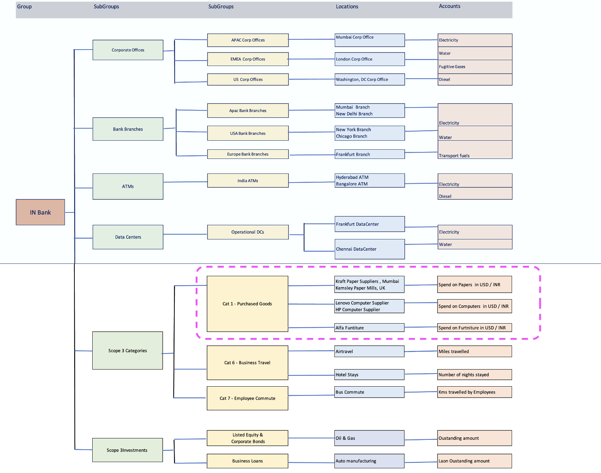

# Leveraging Envizi SupplyChain Intelligence (SCI) for Scalable and Granular Scope 3 Category 1 & 2 Emissions Management

For most organizations, Scope 3 emissions make up a significant portion of their total emissions. Within Scope 3, Category 1 – Purchased Goods & Services often represents a large share.
This makes it important for organizations not only to report total Scope 3 emissions and emissions by each category but also to identify the products and suppliers with the highest impact. Understanding these key contributors helps organizations engage with suppliers effectively and support their decarbonization goals.

In this series of tutorials, you will learn how an organization can use the **Envizi Supply Chain module** to:  

- **Collect data**  
  - Gather **Purchased Goods & Services (PG&S)** data at a granular (transactional) level.  

- **Gain insights**  
  - Identify top contributors to **spend** or **emissions** by product or supplier.  

- **Estimate emissions**  
  - Apply different **methodologies** to calculate or estimate emissions.  

- **Engage suppliers**  
  - Collect supplier data through multiple approaches, such as:  
    - **Product Carbon Footprint (PCF)** information  
    - **ESG surveys** covering:  
      - Consumption data  
      - Scope 1, 2, and 3 emissions  
      - Social & governance metrics  
  - Use different **forms and methods** to gather this information.  

Let’s walk through a practical example using a fictional banking organization, **INBank**, to illustrate this use case. Throughout this tutorial, we’ll follow INBank’s sustainability journey and demonstrate how to leverage Envizi’s tools for effective emissions management. For comprehensive, hands-on labs exploring Envizi in the banking industry, check out the resources [here](https://github.com/ibm-self-serve-assets/envizi-workshop-2024/tree/main/110-Create-Industry-Specific-Org-Hierarchy).

While banks often have significant indirect emissions from investments and loans (Scope 3, Category 15), this exercise will focus on **Scope 3, Category 1: Purchased Goods and Services**. In this context, INBank procures a variety of products — such as stationery, computers, monitors, cash vending machines, and furniture—from multiple suppliers. The diagram below illustrates a sample organizational topology for these procurement activities:

Procurement transactions are typically stored in ERP systems and must be consolidated to accurately calculate emissions. This involves applying the most suitable emission factor methodology—such as spend-based, average data, hybrid, or supplier-specific approaches—to ensure precise and reliable results.

## Getting Started with Envizi Supply Chain Intelligence (SCI)

To begin using Envizi SCI for this scenario, it’s important to organize your data in the format required by the platform. Envizi SCI provides a variety of templates to help you collect and structure your data. These templates are explained in detail in the [official documentation](https://www.ibm.com/docs/en/envizi-supply-chain?topic=configuring-templates-overview) and are grouped into the following categories:

- **Master Data**
- **Mapping**
- **Transactional Data**
- **Custom Factors**

In this tutorial, we will use templates from most of these categories. Custom Factors we will cover in next set of tuitorials.Here’s an overview of the key steps you’ll follow:

### 1. Prepare Master Data
Identify and organize the foundational information for INBank, including:
  - Products and services purchased
  - Suppliers providing these products/services
  - Purchasing organization structure (organizational hierarchy for reporting)
  - Purchasing locations where goods and services are consolidated

### 2. Define Product Mapping
Categorize INBank’s products using a three-level hierarchy and map each product to the appropriate emission factor.

### 3. Import Transactional Data
Once master data and mappings are set up (and rarely change), focus on importing transactional data—specifically, purchase transactions such as orders and order lines—into the system.

---
Let’s explore each of these steps in detail. For a deeper understanding of [data modeling](dataModel.md) and the relationships between objects created by these templates, refer to the official documentation.

Navigate to each section using the links below:

1. [Prepare Master Data](masterData.md)
2. [Define Product Mapping](productMapping.md)
3. [Import Transactional Data](transactionalData.md)

