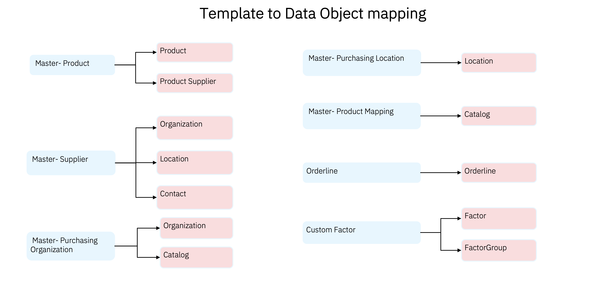
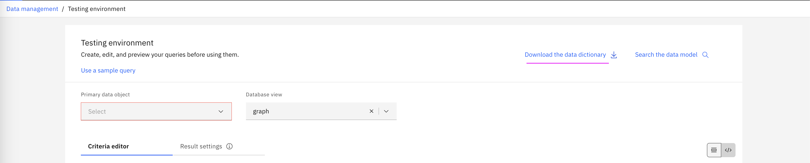
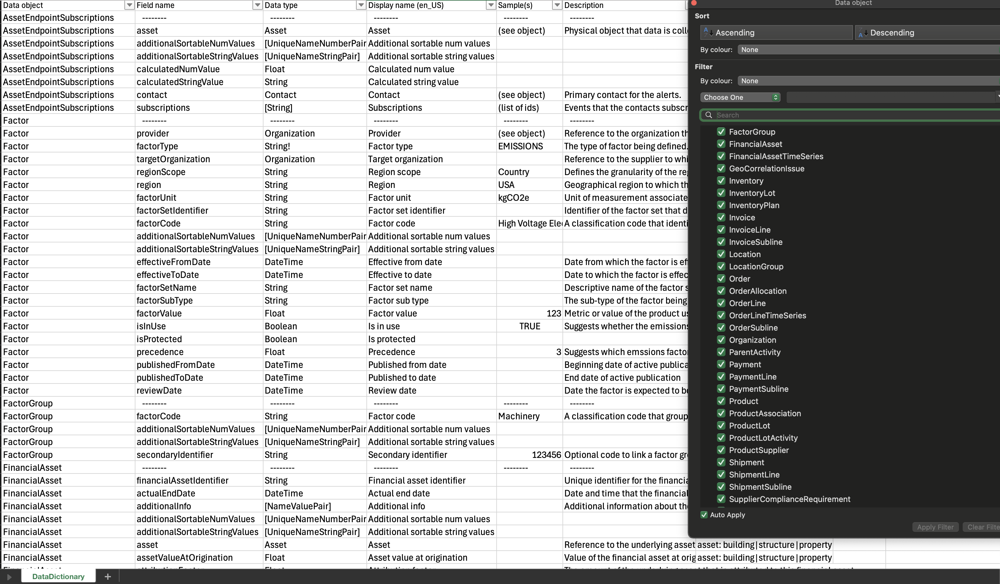
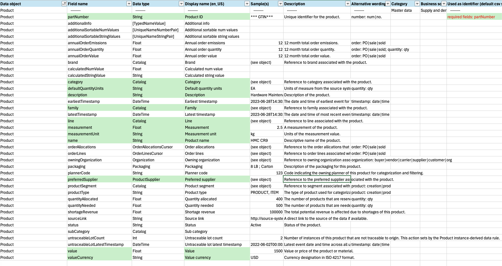
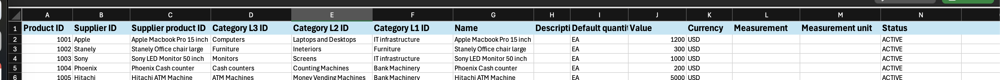
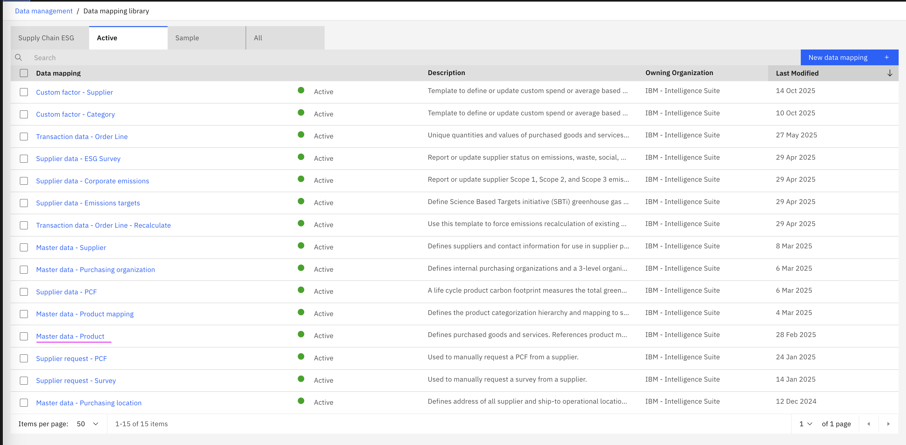
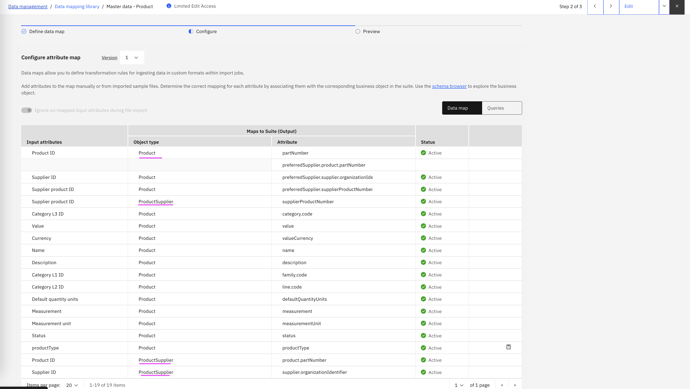

# Data Modelling 

As we work on ingesting data using the CSV templates into Envizi SCI, it is important to understand the data model at a high level. Understanding the underlying data strutures will help you to deal with advanced scenarios, like querying / deleting the existing data.  In this section, let's explore and get familiar with:

- How the SCI data model is defined
- How data ingested via templates is mapped to underlying data objects
- What the different objects are and how they are associated
- How to view the different objects and their relationships

In SCI, data is loaded through CSV templates (for example: Product, Supplier, Purchasing Organization, Purchasing Location, Transaction Orderline). Each template maps to one or more underlying data objects — e.g., Product, Product Supplier, Organization, Location, Contact, and OrderLine. These mappings (the association between input attributes and target data objects) are predefined in the platform.  

To view or manage them, open `Data Mapping` under `Admin > Data Management > Data mapping`.

At a very high-level, the mapping between templates and the data objects looks like below

  

Lets dive into the details to understand a bit deeper on the data objects and the association. The definition of each data object can be found in the data dictionary which can be downloaded from `Admin > Data Management > Data testing` or [here](data-dictionary/DataDictionary.csv).

  

View the details of the data objects such as fields, data types, associated objects, required fields, etc from DataDictionary.csv. 

  

In the screenshot, data filter on right side shows the different data objects in the system. 

Let's view a specific data object, let's say `Product` 

  

The "Used as identifier (default csv schema)" column shows which field the system uses as the primary product identifier. For the Product object this is `partNumber` (displayed as "Product ID" (en_US)) — this field is required when creating or updating products via CSV.

Fields in the data dictionary are either primitive types (e.g., `string`, `number`, `date`) or references to other objects (e.g., `Product Supplier`, `Catalog`). Primitive fields contain direct values; object fields represent relationships and are resolved by matching the referenced object’s identifier(s) during import.

Here is  Master Product template. 

  

Now review the template-to-object mapping to confirm how each CSV column maps to object fields. Open `Admin > Data Management > Data Mapping and select "Master data - Product"` to inspect the mappings. Then compare the CSV template above to understand how the mapping is done. 

When you import the Master Product template, the system automatically lists the related object types (for example: Product and Product Supplier). 
View the mapping definition at:
`Admin > Data Management > Data Mapping > View data maps > Active > Master data - Product.`

  

To inspect the mapping details (column-to-field mappings, target objects, and identifier fields), open Master data - Product and click Configure.

  

> **Important — Read Before Proceeding**
>
> Do NOT edit or delete these configurations. Modifying them can corrupt the system and cause data loss. Only view the associated mappings for understanding. If changes are required, contact your administrator or support team.

In similar fashion, you can explore the association between other templates and the data objects. 
