# Prepare Master Data in SCI for INBank

In this section, you will learn how to use the **master data templates** and populate them with INBank’s data for Supply Chain Intelligence (SCI).

---

## Step 1: Download Standard Templates

The standard templates are available for download [here](https://www.ibm.com/docs/en/SSULNGL/attachments/templates/envizi_sci_templates.zip). Download and extract these files to your local system.

  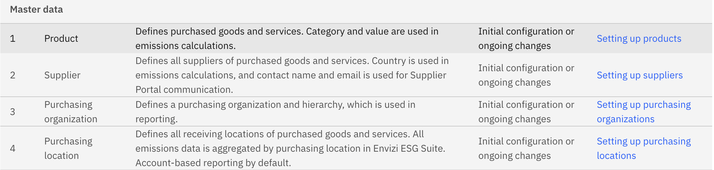

---

## Step 2: Review and Prepare Templates

Examine each template and fill it out using the Purchased Goods & Services data collected from INBank.

---

## 2.1 Setting Up Products
Product data lists everything your organization buys—goods and services. This is essential for tracking emissions, managing suppliers, and making better business decisions in Envizi SCI.

**Why is it important?**
- Helps track spending and supplier performance
- Makes it easy to update as your purchases change
- Connects products to suppliers, locations, and transactions
- Lets you calculate emissions for each product or service or product category wise

Example screenshots of the platform after completing the tutorial

Explore Products  : `Reporting > Data Explorer > Products`

  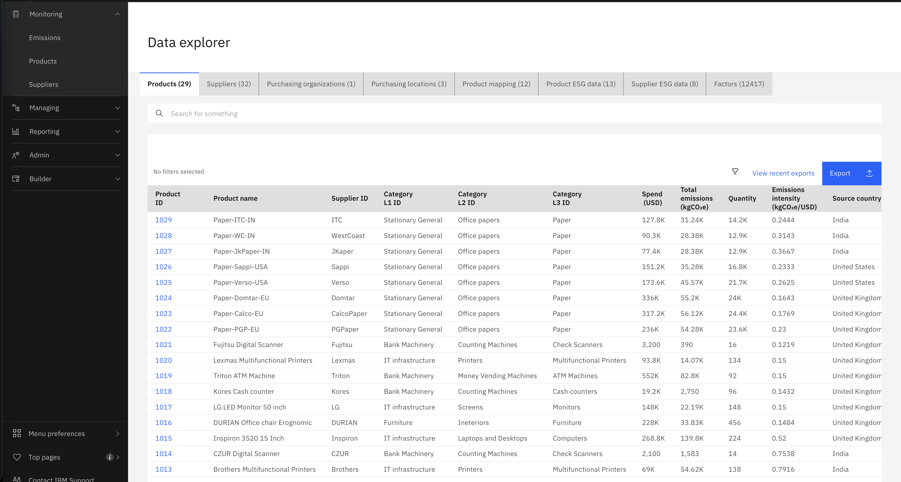

 

Product details  : `Reporting > Data Explorer > Products > ` click on any product 

  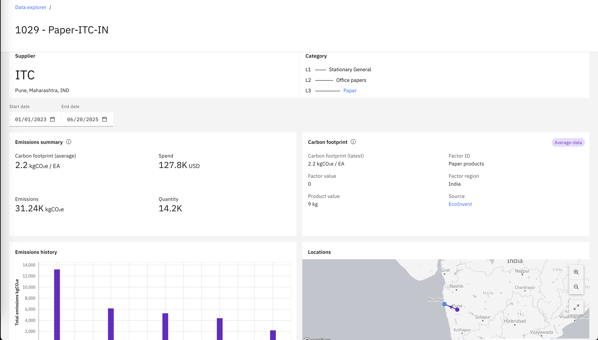

 

  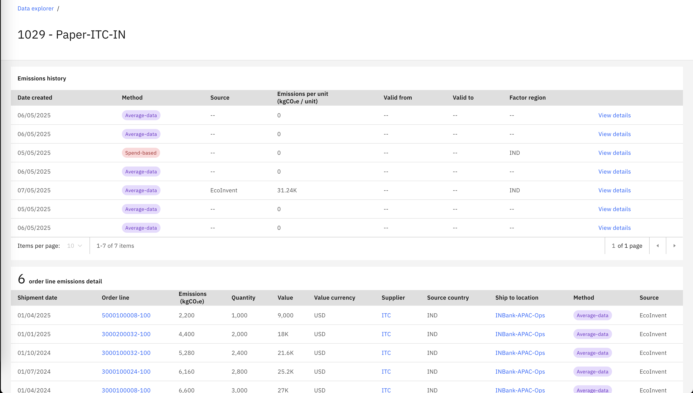

 

**What insights do you get?**
 - Discover which product categories generate the most emissions or incur the highest costs.
 - See which suppliers receive the largest share of your spend.
 - Identify suppliers that are the biggest contributors to your emissions.
 - Check how many products include Product Carbon Footprint (PCF) data.
 - Assess the completeness and quality of PCF data across your product catalogue.
  
Example screenshots of the platform after completing the tutorial

Product level insights : `Monitor > Products`

  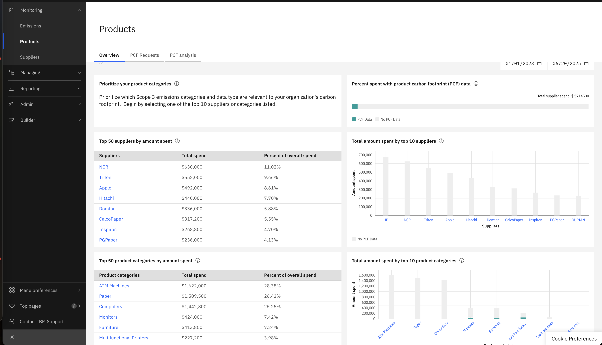

Product Category insights based on specific category filter : `Monitor > Emissions > Category view `

  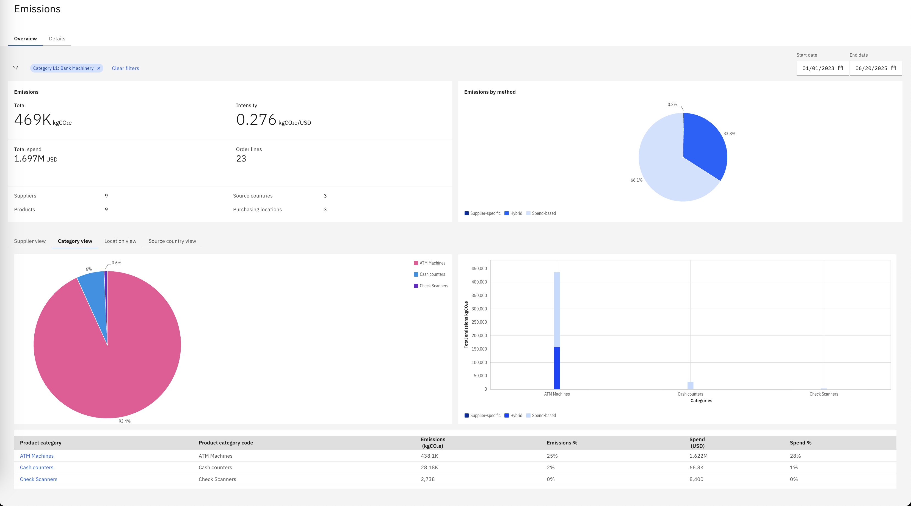

Now, let’s explore how this can be accomplished by following the steps outlined below.

### 2.1.1 Get the Product Template

1. Copy the template file with the name *Envizi-SCI-master-Product.csv* 

  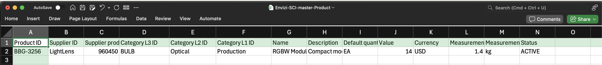

2. Review the header columns and sample data. Detailed explanations for each column are provided [here](https://www.ibm.com/docs/en/envizi-supply-chain?topic=configuring-setting-up-products):

- **Product ID** (Required)
  - Unique identifier for the product. Use an ID generated by your organisation or an existing ERP/ERP‑exported ID.
  - Example: `1001`

- **Supplier ID** (Required)
  - Unique identifier for the supplier. This can be organisation‑generated or taken from your ERP.
  - Example: `Apple`

- **Supplier Product ID** (Optional)
  - Identifier provided by the supplier (product / part number). The `Product ID` is the organisation's unique key.
  - Example: `Apple Macbook Pro 15 inch`

The category codes (L1–L3) create a product hierarchy for classification and reporting. For INBank we use the hierarchy (`L1 > L2 > L3`) for example:  `IT infrastructure > Laptops and Desktops > Computers`). Please refer the [`Product Mapping` template section](productMapping.md) to understand and identify the corresponding `Category ID` for each product. 

- **Category L1 ID** (Required)
  - Top-level category (product family).
  - Example: `IT infrastructure`

- **Category L2 ID** (Required)
  - Mid-level category (group/brand).
  - Example: `Laptops and Desktops`

- **Category L3 ID** (Required)
  - Lowest-level category (specific category).
  - Example: `Computers`

- **Name** (Required)
  - Product name shown in the UI.
  - Example: `Apple MacBook Pro 15"`

- **Description** (Required)
  - Brief free-text description of the product.

- **Default Quantity Units** (Recommended)
  - Recommended: `EA` (Each). Use standard UOM or ISO format where possible.

- **Value** (Required)
  - Price or value of the product (numeric).
  - Example: `1200`

- **Currency** (Required)
  - Currency in ISO 4217 format.
  - Example: `USD`
  - _Note: At the time of writing this document only `USD` is supported._

- **Measurement** (Optional)
  - Numeric measurement used for average‑data emission calculations (becomes required when using that method).
  - Example: `1`

- **Measurement Unit** (Optional)
  - Unit for the measurement value (e.g., `kg`).
  - Example: `kg`

- **Status** (Optional)
  - Useful values: `ACTIVE`, `INACTIVE`.
  - Example: `ACTIVE`

---

### 2.1.2 Populate the Product File

Fill in all required fields. For example, INBank purchases a variety of products in categories such as - Computers,Monitors, Furniture, Cash counters, ATMs, Machines, Multifunctional Printers, Check Scanners

...from different suppliers across various regions. So make sure to gather all the relevant data before populating the template.  And also identify the product categories and product category hierarchy before hand so that the correct mapping can be created in the master product data file. Please refer the [`Product Mapping` template section](productMapping.md) for more details.

  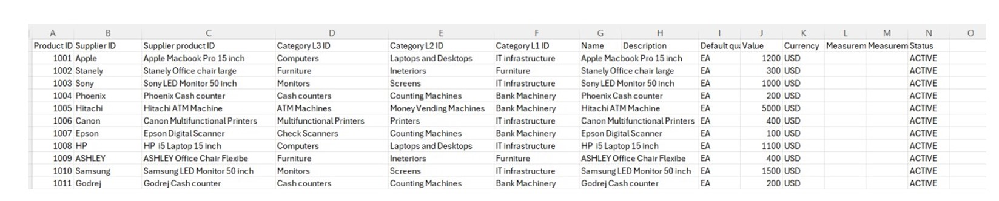

You can use the pre-populated data file provided here and update it as needed: `data-files/1.Master/Envizi-SCI-master-Product_INBank.csv`

 

### 2.1.3 Uploading the Products Data to SCI

Follow these steps to upload your completed product master data file into Envizi SCI:

1. **Log in to SCI**
  - Ensure you are in the correct tenant. (Example tenants: `GSI Demos`, `Supply Chain ESG`—your tenant name may differ.)
  

    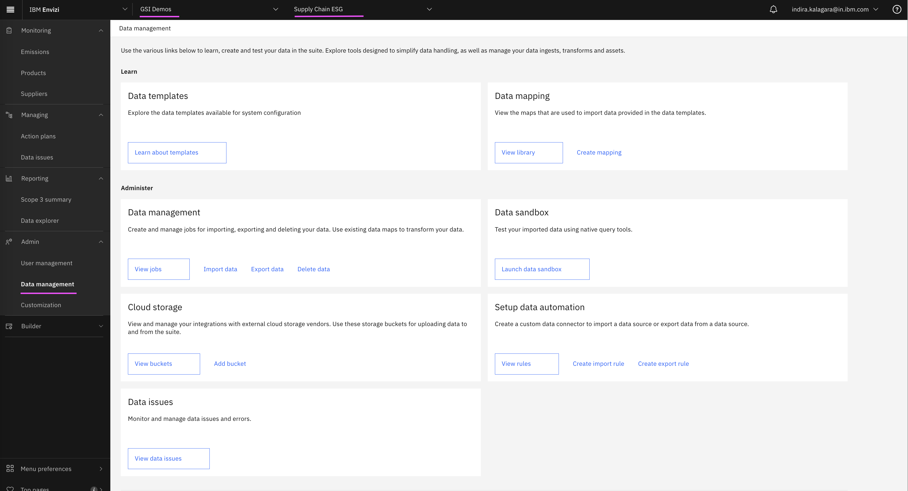
  

2. **Navigate to Data Management**
  - On the left sidebar, go to `Admin > Data Management`.

3. **Start a New Import Job**
  - On the Data Management page, click `Import Data`.
  - In the New Import Job pop-up, click `Add file` and select your completed product master data file (e.g., `Envizi-SCI-master-Product_INBank.csv`).
  - You can leave `Ingest priority` as default.

4. **Select Data Mapping**
  - From the list of Data Mappings, select `Master data - Product (masterDataProduct)`.
  - Leave `Data mapping version` and `Delimiter` as default (`COMMA`).

5. **Set Other Import job Options**

  - `Object types` will be auto-populated based on your mapping. (The Product template creates two objects: `Product` and `Product Supplier`.)
  - Leave `Bucket` as default: `Intelligence Suite default file storage`.
  

  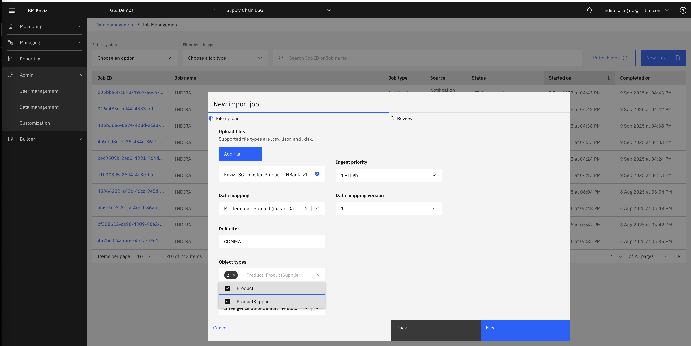

  
6. **Review and Import**
  - Click `Next` to review your selections.
  
  

  

  

  - Click `Import` to start the job.
  - You should see a message: _New import job created. Job {Job ID} has been successfully created._

7. **Check Import Status**
  - Uploading the product master data will create two jobs (for the two object types) - `Product` and `Product Supplier`. [Review data model](Images/SCI-datamodel-master-2.png)
  

      

  
  Ensure both import jobs have completed successfully before proceeding.

  

    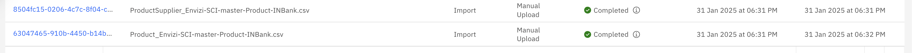
  

  If a job is `CompletedWithErrors` or `Rejected`:
  - Open the job details page and review the error messages.
  - See the Troubleshooting guide: [Troubleshooting](troubleshooting.md).
  - Identify the root cause, correct the CSV, and re-run the import.
  - Repeat until both jobs show `Completed`.

8. **View Products from Data Explorer**
  - Navigate to  `Reporting > Data Exploer > Products` to view the products.
  
 

  

  
   
## 2.2 Setting up purchasing organizations 
Purchasing organization data shows how your company is structured for buying goods and services. This is key for accurate reporting, better management, and smarter decisions in Envizi SCI.

**Why is it important?**
- To consolidate and report emissions at organization level
- To track total number of suppliers the organization involved with
- To track total number of products the organiztionation is purchasing
- Get view on the procurement sites as well as source countries.
- To ensure reporting matches the real company structure

Example screenshots of the platform after completing the tutorial

Explore Products  : `Reporting > Data Explorer > Purchasing organizations `

  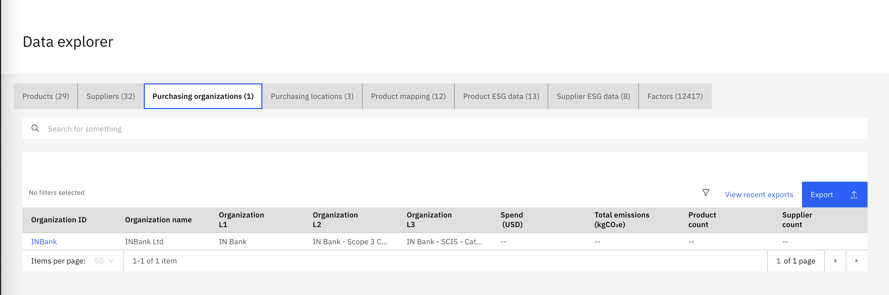

**What insights do you get?**

- Overall emissions and emissions intensity at the organization level
- Different views at Supplier / Category/Location/ Source country, etc
- Get clear view on which supplier / product category/ location / surce country is major contributor 
- Get clear view on which the hightest emission contribution GHG methodlogy (Spend/average/hybrid/supplier-specific)

  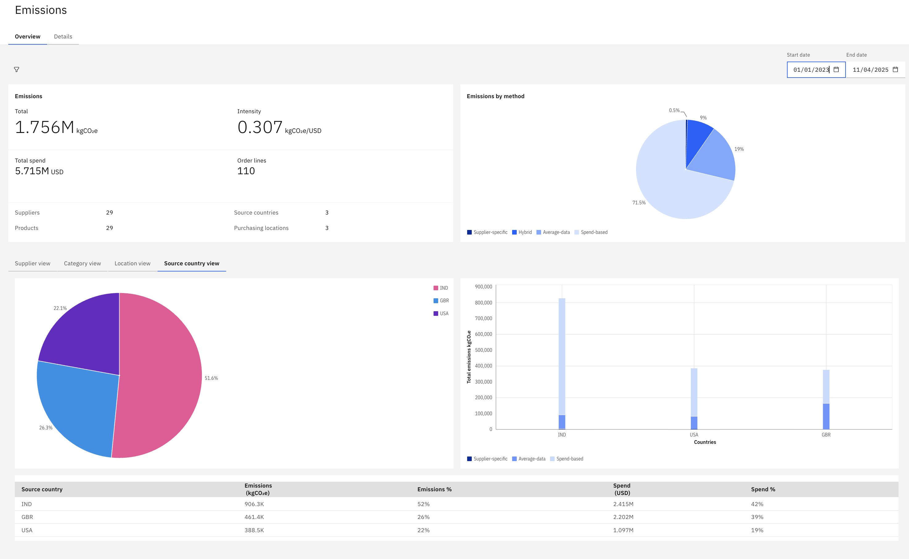

  

### 2.2.1 **Get the Purchasing organization Template:** 

1. Copy the template file with the name *Envizi-SCI-master-Purchasing organization.csv* 

  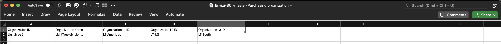

2. Review the header columns and sample data. Detailed explanations for each column are provided [here](https://www.ibm.com/docs/en/envizi-supply-chain?topic=configuring-setting-up-purchasing-organizations). Below are the fields required for each purchasing organization, formatted with brief descriptions and examples.

- **Organization ID** (Required)
  - Unique identifier for the purchasing organisation 
  - Example: `INBank`

- **Organization name** (Required)
  - Human-readable name of the organisation.
  - Example: `INBank Ltd`

- **Organization L1 ID** (Required)
  - Top-level organisation hierarchy (L1).
  - Example: `IN Bank`

- **Organization L2 ID** (Required)
  - Second-level hierarchy (L2) used for grouping under L1.
  - Example: `IN Bank - Scope 3 Categories`

- **Organization L3 ID** (Required)
  - Third-level hierarchy (L3) used for detailed reporting and roll-ups.
  - Example: `IN Bank - SCIS - Cat1 - PGS`

Note: If a specific value is not known or not required for a field, use <b>'All'</b> to indicate a global/default value. In this example we have given the hierarchy aligned with Envizi Grouping structure, which is not necessarily be the case.

### 2.2.2 Populate the Purchasing Organization file

For INBank organization, below is a sample organization heirarchy which can used for reporting. This can be updated if the organization reporting needs change at later point of time. 

Sample data  shown below 

  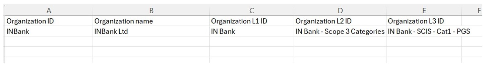

 
You can use the pre-populated data file provided here and update it as needed: `data-files/1.Master/Envizi-SCI-master-Purchasing organization_INBank.csv`

### 2.2.3 Uploading the Purchasing Organization Data to SCI

Follow these steps to set up INBank organization heirarchy in SCI. 

1. **Navigate to Data Management**
  - On the left sidebar, go to `Admin > Data Management`.

2. **Start a New Import Job**
  - On the Data Management page, click `Import Data`.
  - In the New Import Job pop-up, click `Add file` and select your completed product master data file (e.g., `Envizi-SCI-master-Purchasing organization_INBank.csv`).
  - You can leave `Ingest priority` as default.

3. **Select Data Mapping**
  - From the list of Data Mappings, select `Master data - Purchasing organization (masterDataPurchasingOrganization)`.
  - Leave `Data mapping version` and `Delimiter` as default (`COMMA`).

  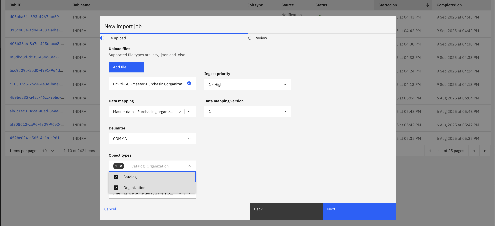

4. **Set Other Import job Options**

  - `Object types` will be auto-populated based on your mapping. (The Product template creates two objects: `Catalog` and `Organization`.)
  - Leave `Bucket` as default: `Intelligence Suite default file storage`.
  

5. **Review and Import**
  - Click `Next` to review your selections.
  - Click `Import` to start the job.
  - You should see a message: _New import job created. Job {Job ID} has been successfully created._
 

  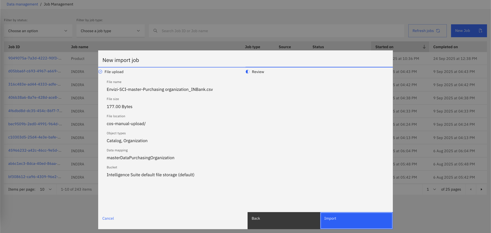

6. **Check Import Status**
  - Uploading the product master data will create two jobs (for the two object types `Catalog` and `Organization`). [Review data model](Images/SCI-datamodel-master-2.png)
 
  Ensure both import jobs have completed successfully before proceeding.
  If a job is `CompletedWithErrors` or `Rejected`:
  - Open the job details page and review the error messages.
  - See the Troubleshooting guide: [Troubleshooting](troubleshooting.md).
  - Identify the root cause, correct the CSV, and re-run the import.
  - Repeat until both jobs show `Completed`.

7. **View Purchasing Organizations from Data Explorer**
  - Navigate to  `Reporting > Data Exploer > Purchasing Organizations` to view the products.

## 2.3 Setting up purchasing locations 

Purchasing location data lists all the places where the organization receives goods and services—like branches, offices, and warehouses. Keeping this data up to date gives you better insights and reporting in Envizi SCI.

**Why is it important?**
- Track total spend/ emissions for each site/location
- To Idenfity number of unique products purchased from each location
- Find number of Suppliers associated with location.
- Emission intensity of the location
- Requires to identify correct emission factor
- Powers maps and dashboards for easy analysis
- To create targeted action plans for specific sites

Example screenshots of the platform after completing the tutorial

Purchasing location  : `Reporting > Data Explorer > Purchasing Locations`

  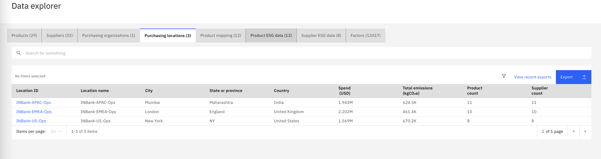

  

Drill-down on any location

  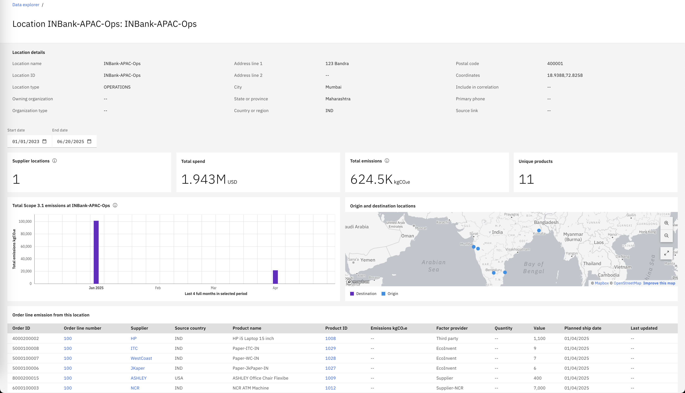

  
 

**What insights do you get?**
- Clear view on % of Emission and spend contribution by each location
- Which methods used for emission calcuation at each location
- % of emission based on GHG method (spend/average,etc) 
- % of emission based on GHG method (spend/average,etc) for each location.  
- Compare location performance using filter

Example screenshots of the platform after completing the tutorial. 

 `Monitoring > Emissions > Location view`

  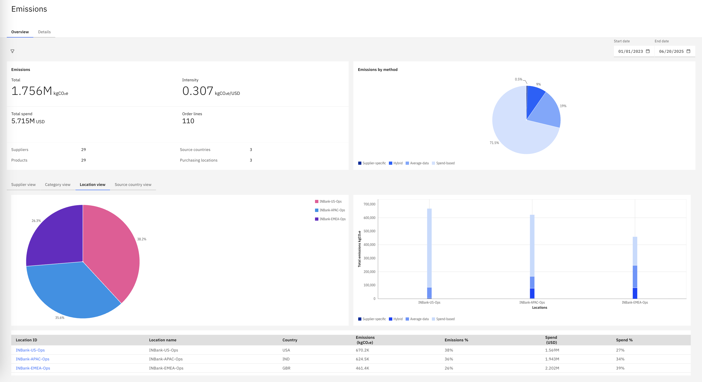

  

Compare location performance using filters

Purchasing location  : `Monitor > Products`

  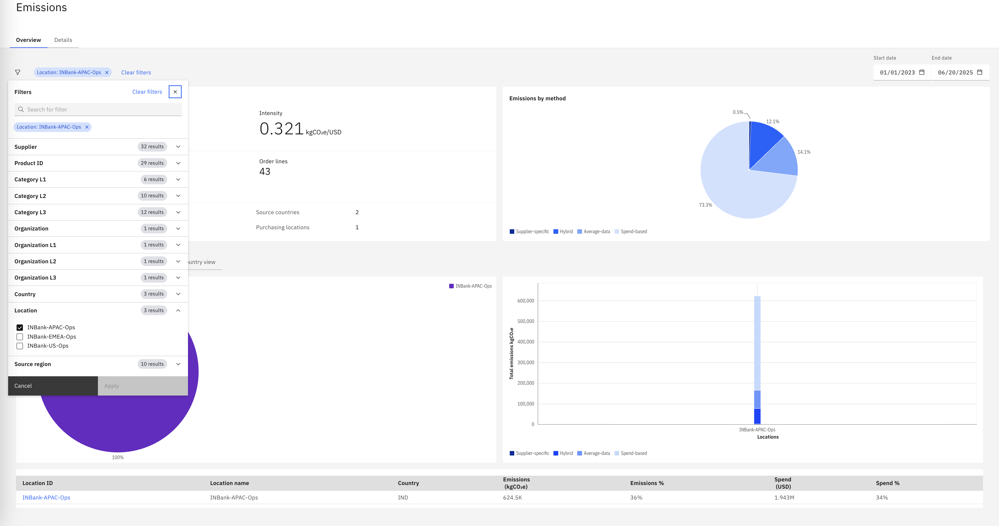

  

### 2.3.1 **Get the Purchasing location Template:** 

1. Copy the template file with the name *Envizi-SCI-master-Purchasing location.csv* 

  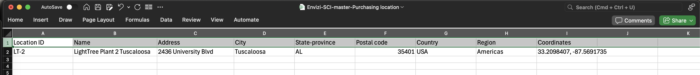

2. Review the header columns and sample data. Detailed explanations for each column are provided [here](https://www.ibm.com/docs/en/envizi-supply-chain?topic=configuring-setting-up-purchasing-locations)

Below are the key fields for each purchasing location, presented with a short description and examples where helpful.

- **Location ID** (Required)
  - Unique identifier for the location (primary key used across imports).
  - Example: `INBank-APAC-Ops`

- **Name** (Required)
  - Descriptive name shown in the UI.
  - Example: `INBank-APAC-Ops`

- **Address** (Recommended)
  - Street address for the location.
  - Example: `123 Marine Drive`

- **City** (Recommended)
  - City name for the location.
  - Example: `Mumbai`

- **State/province** (Recommended)
  - State or province name.
  - Example: `Maharashtra`

- **Postal code** (Recommended)
  - Postal or ZIP code for the address.
  - Example: `400001`

- **Country** (Required)
  - Country code in ISO 3-character format.
  - Example: `IND`

- **Region** (Recommended)
  - Regional grouping (useful for reporting: e.g., APAC, EMEA).
  - Example: `West`

- **Coordinates** (Optional)
  - Geospatial coordinates (latitude, longitude) 
  - Example: `18.9388,72.8258`

Note: The Location ID in Envizi Supply Chain Intelligence must match the location reference in Envizi ESG Suite.

### 2.3.2 Populate the Purchasing location file

For INBank organization, below is a sample organization heirarchy which can used for reporting. This can be updated if the organization reporting needs change at later point of time. 

Sample data  shown below 

  

 
You can use the pre-populated data file provided here and update it as needed: `data-files/1.Master/Envizi-SCI-master-Purchasing location_INBank.csv`

 

### 2.3.3 Uploading the Purchasing Location Data to SCI

To upload your purchasing location data, simply follow the same steps as before for uploading master data. 
  - When selecting the data mapping, choose `Master data - Purchasing location (masterDataPurchasingLocation)`.
  - Leave `Data mapping version` and `Delimiter` as default (`COMMA`).

  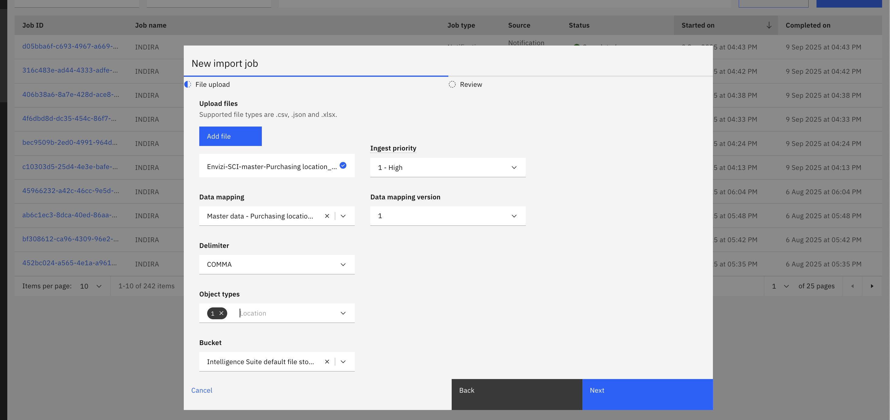

  - `Object types` will be auto-populated based on your mapping. (The Purchasing Location template creates only object:  `Location`) [Review data model](Images/SCI-datamodel-master-2.png)
  
- Review and Import the file

- Uploading the purchasing location data will create a single jobs for object type - `Location` . [Review data model](Images/SCI-datamodel-master-2.png)

  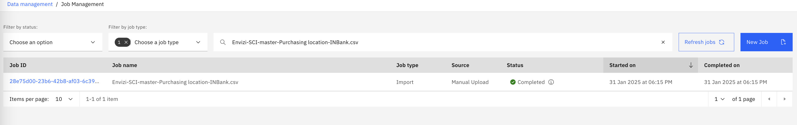

  
- Ensure  the import job has completed successfully before proceeding.
  If a job is `CompletedWithErrors` or `Rejected`:
  - Open the job details page and review the error messages.
  - See the Troubleshooting guide: [Troubleshooting](troubleshooting.md).
  - Identify the root cause, correct the CSV, and re-run the import.
  - Repeat until the job show `Completed`.

- View Purchasing locations from Data Explorer `Reporting > Data Exploer > Purchasing locations` 
   

## 2.4 Setting up Suppliers

Supplier data lists all the companies or people the organization buys goods and services from. Keeping this information up to date is key for accurate emissions tracking, supplier engagement, and better business decisions in Envizi SCI.

**Why is it important?**
- To calculate emissions for each supplier
- Links suppliers to products, locations, and transactions
- To engage with suppliers to capture supplier-specific data such as 
  - Product carbon footprint, ESG survey
  - ESG Risk, Net-zero targets
  - Supplier due diligence
  - Carbon-offset programs, etc
- Powers detailed supplier reports and dashboards

Example screenshots of the platform after completing the tutorial

Explore Suppliers : `Reporting > Data Explorer > Suppliers`

  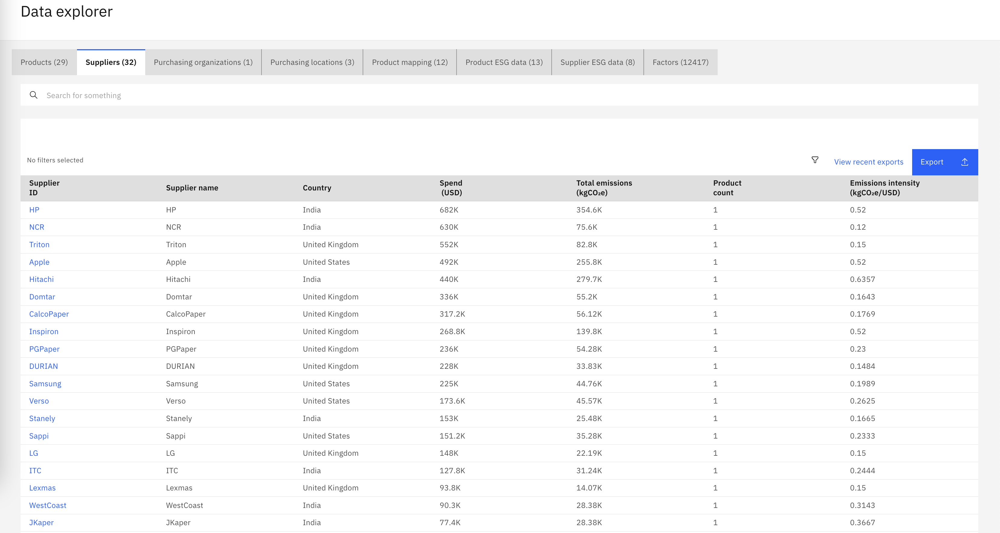

Explore specific supplier : `Reporting > Data Explorer > Suppliers > click on any supplier`

  

**What insights do you get?**
- See which suppliers have the highest emissions or costs
- % of emissions contributed by each supplier
- % of emissions by each GHG method , and by supplier
- % of suppliers with emission data
- Number of Supplier engagements and progress on each engagement
- View on request status (pending/ requires approval/completed)
- Compare supplier performance and spot trends
- Track progress as you work with suppliers to reduce emissions

Example screenshots of the platform after completing the tutorial

Supplier Emissions view  : `Monitoring > Emissions > Supplier view`

  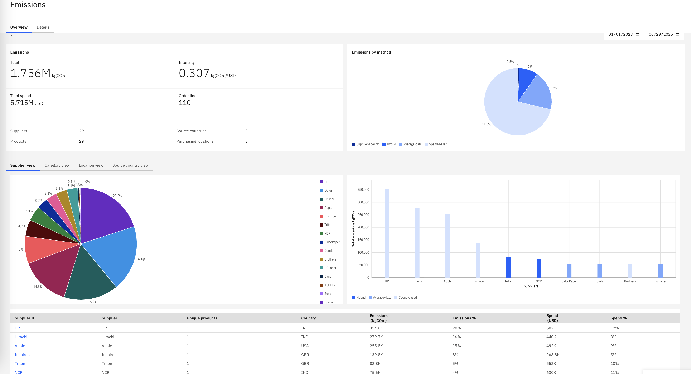

Lets say you want to compare suppliers for a product category IT infrastructure.

Emissions view  : `Select Filter >  Category L1: IT infrastructure > Suppliers : Apple & HP & Inspirion`

  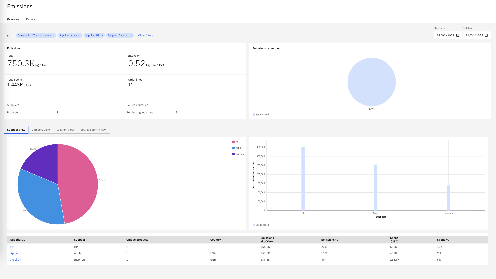

### 2.4.1 **Get the Suppliers Template:** 

1. Copy the template file with the name *Envizi-SCI-master-Supplier.csv* 

  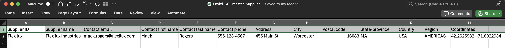

2. Review the header columns and sample data. Detailed explanations for each column are provided [here](https://www.ibm.com/docs/en/envizi-supply-chain?topic=configuring-setting-up-suppliers).

Below are the fields for each Supplier, with a short description and an example where helpful.

- **Supplier ID** (Required)
  - Unique identifier for the supplier. Must match with `Supplier ID` from `Master product` template.
  - Example: `SUPP001`

- **Supplier name** (Required)
  - Descriptive name shown in the user interface.
  - Example: `Apple Inc.`

- **Contact email** (Required)
  - Email address for the supplier contact. 
  - Make sure to use valid email, to help engage with Supplier when using Action plans and sending notifications, etc. 
  -This email is used by purchasing organization to onboard supplier to `Supplier Portal` which enables supplier to login to `Supplier Portal`
  - If there are any changes in contact email, can also be updated later.
  - Example: `support@apple.com`

- **Contact first name** (Required)
  - Given name of the primary contact.
  - Example: `John`

- **Contact last name** (Required)
  - Surname of the primary contact.
  - Example: `Appleseed`

- **Contact phone** (Recommended)
  - Phone number for the supplier contact. 

- **Address** (Recommended)
  - Street address for the supplier's primary location.
  - Example: `1 Infinite Loop, Cupertino, CA`

- **City** (Recommended)
  - City name for the supplier address.
  - Example: `Cupertino`

- **State/province** (Recommended)
  - State or province name.
  - Example: `CA`

- **Postal code** (Recommended)
  - Postal or ZIP code.
  - Example: `95014`

- **Country** (Required)
  - Country code in ISO 3-character format.
  - Example: `USA`

- **Region** (Recommended)
  - Regional description of the country (e.g., APAC, EMEA, NA).
  - Example: `North America`

- **Coordinates** (Optional)
  - Geospatial coordinates (latitude, longitude) for mapping.
  - Example: `37.3318,-122.0312`

### 2.4.2 Populate the Suppliers template

To fill in the supplier details, INBank lists all the companies it buys goods/products and services from. Even though each region may handle its own purchases, we bring all this information together in Envizi SCI for a complete view.

Be sure to enter supplier details as accurately as possible. Key fields like country and region are important for calculating the right emission factors, and a valid email address is needed if INBank wants to contact or engage with a supplier.

Below is a sample of how INBank’s suppliers are spread across different regions. This helps demonstrate how supplier information can impact emission calculations.

  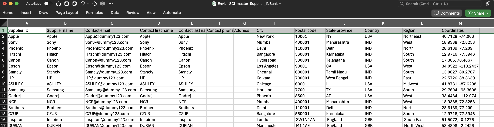

You can use the pre-populated data file and update it as needed: `data-files/1.Master/Envizi-SCI-master-Purchasing organization_INBank.csv`

### 2.4.3 Uploading the Suppliers  Data to SCI

To upload supplier data, simply follow the same steps as before for uploading master data. 
- When selecting the data mapping, choose `Master data - Supplier (masterDataSupplier)`.
  - Leave `Data mapping version` and `Delimiter` as default (`COMMA`).

  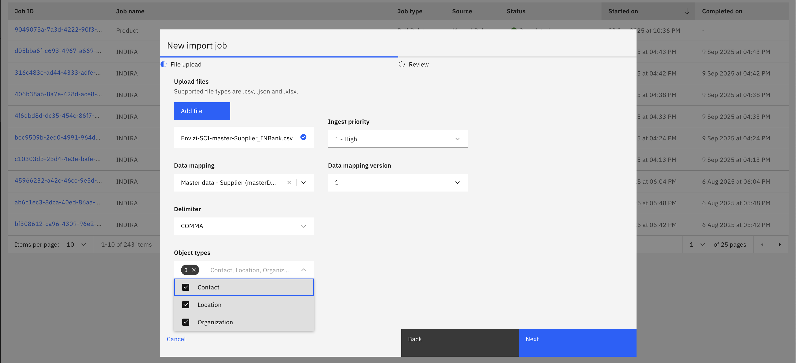

  - `Object types` will be auto-populated based on your mapping. (The Supplier template creates 3 objects: `Organization, Location, Contact`) [Review data model](Images/SCI-datamodel-master-2.png)

  
- Review and Import the file

- Uploading the Supplier data will create 3 jobs for each object type - `Organization, Location, Contact` . [Review data model](Images/SCI-datamodel-master-2.png)

  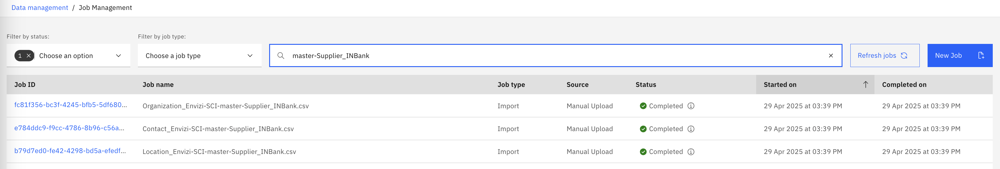

  

- Ensure  that all the 3 import jobs are completed successfully before proceeding.
  If a job is `CompletedWithErrors` or `Rejected`:
  - Open the job details page and review the error messages.
  - See the Troubleshooting guide: [Troubleshooting](troubleshooting.md).
  - Identify the root cause, correct the CSV, and re-run the import.
  - Repeat until all the jobs show `Completed`.

- View Suppliers from Data Explorer `Reporting > Data Exploer > Suppliers` 
   
You’ve now uploaded all master data into SCI. Next, you’ll learn how to map product data to emission factor categories and import transactional data.
  

