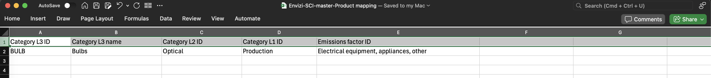
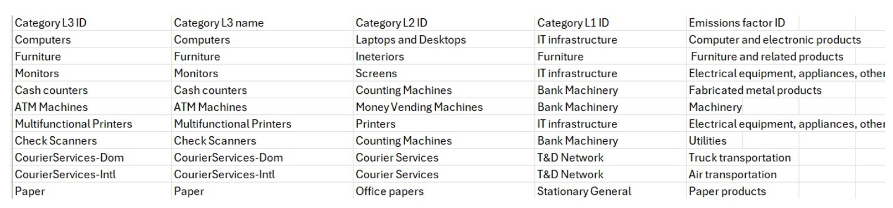
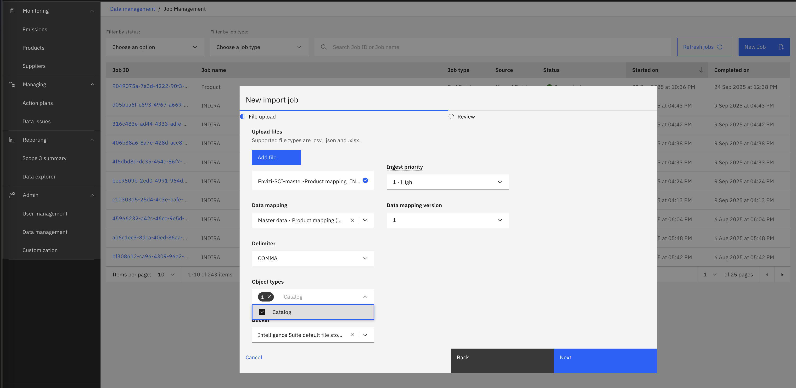
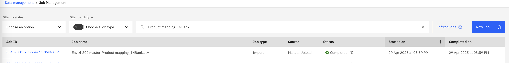
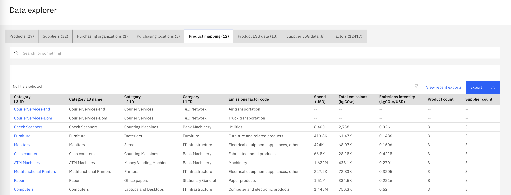

# Define Product Mapping

Product mapping links each product category to the right emission factor, so Envizi SCI can calculate emissions accurately for every product or service you buy.  Basically this mapping allows you to identify an EORA-66 factor code for each product cateogry so that the corresponding spend-based emissions are calculated. 
The spend-based factors calculations can be overwritten as the organization moves to the more accurate emission calculation methods, such as average / supplier-specific etc which can be defined using custom factors. 

Defining the Product herirachy appropriately also help organization to view the data with various  drilling-down/ filtering  options in SCI dashboards. 

Lets look at the following sections on how INBank organization maps their product categories to appropriate emission factor codes.  Identifying and assigning spend-based emission factor code is currently manual process and our product team is working towards automated classification using AI.

---

## 1. Get the Product Mapping Template

1. Copy the template file with the name *Envizi-SCI-master-Product mapping.csv* 

  

2. Review the header columns and sample data. Detailed explanations for each column are provided [here](https://www.ibm.com/docs/en/envizi-supply-chain?topic=configuring-assigning-product-category-factors):

  The category codes (L1–L3) create a product hierarchy for classification and reporting.
  INBank identifies the hierarchy (`L1 > L2 > L3`) for all their products and follows the pattern  
  for example:  `IT infrastructure > Laptops and Desktops > Computers`). 
  
  Please note that this same hierarchy should be used and appropriately assgined to each product when creating the product list using the master product template. 

  
- **Category L3 ID** (Required)
  - Lowest-level category (specific category).
  - Unique identifiers for all the 
  - Match to  `Category L3 ID` of master Product file
  - Example: `Computers`

- **Category L3 Name** (Required)
  - Lowest-level category (specific category).
  - Match to  `Category L3 Name` of master Product file
  - Example: `Computers`  
  
- **Category L2 ID** (Required)
  - Mid-level category (group/brand).
  - Match to  `Category L2 ID` of master Product file 
  - Example: `Laptops and Desktops`

- **Category L1 ID** (Required)
  - Top-level category (product family). 
  - Match to  `Category L1 ID` of master Product file
  - Example: `IT infrastructure`

  Note: Make sure to have unique identifiers for all the category ids as well as logically aligned to your organizational requirements so that it can help to vewi

- **Emissions factor ID** (Required)
  -  The code for the emissions factor group to use for this product category. See the [Factor codes list here](https://www.ibm.com/docs/en/envizi-supply-chain?topic=configuring-assigning-product-category-factors#assigning_product_category_factors__ph_bqc_n4h_m2c) for allowed values 
  - Example: `Computer and electronic products` 

  *Note: If you do not have a specific value for any category ID, use 'All'.*

## 2. Populate the Product Mapping File

Fill in all required fields. For each of the product category map the EORA-66 emission factor id.  This step plays a very important role as the calculation of emissions for a given product depends on the emission factor code which you are mapping it here.  It may also good to note that, as EORA-66 is broadly categorized  in 66 different categories, some of the products may fall into the same emission factory category to start with. So, identify the products / product categories in detail and assign the factor code. 

      

  
You can use the pre-populated data file provided here and update it as needed: `data-files/2.Mapping/Envizi-SCI-master-Product mapping_INBank.csv`

## 3 Uploading the Product Mapping Data to SCI

Follow these steps to create produdct mapping in SCI. 

1. **Navigate to Data Management**
  - On the left sidebar, go to `Admin > Data Management`.

2. **Start a New Import Job**
  - On the Data Management page, click `Upload data > Upload Data`.
  - In the New Import Job pop-up, click `Add file` and select your completed master product mapping data file (e.g., `Envizi-SCI-master-Product mapping_INBank.csv`).
  - You can leave `Ingest priority` as default.

3. **Select Data Mapping**
  - From the list of Data Mappings, select `Master data - Product mapping (masterDataProductMapping)`.
  - Leave `Data mapping version` and `Delimiter` as default (`COMMA`).

  

4. **Set Other Import job Options**

  - `Object types` will be auto-populated based on your mapping. (The Product Mapping template creates an object: `Catalog`)
  - Leave `Bucket` as default: `Intelligence Suite default file storage`.
  
5. **Review and Import**
  - Click `Next` to review your selections.
  - Click `Import` to start the job.
  - You should see a message: _New import job created. Job {Job ID} has been successfully created._
 

6. **Check Import Status**
  - Uploading the product mapping  data will create a object type `Catalog`
 

  

   - Ensure  the import job has completed successfully before proceeding.
  If a job is `CompletedWithErrors` or `Rejected`:
      - Open the job details page and review the error messages.
      - See the Troubleshooting guide: [Troubleshooting](troubleshooting.md).
      - Identify the root cause, correct the CSV, and re-run the import.
      - Repeat until the job show `Completed`.`

7. **View Product Mapping from Data Explorer**
  - Navigate to  `Reporting > Data Explorer > Product Mapping` to view the products.

  

