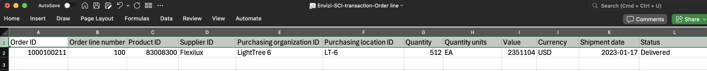
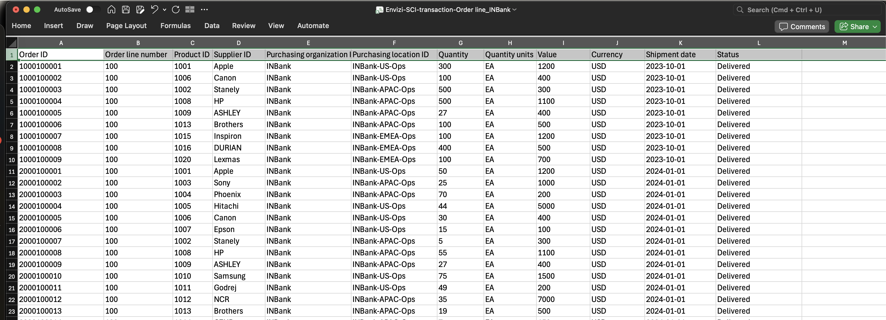
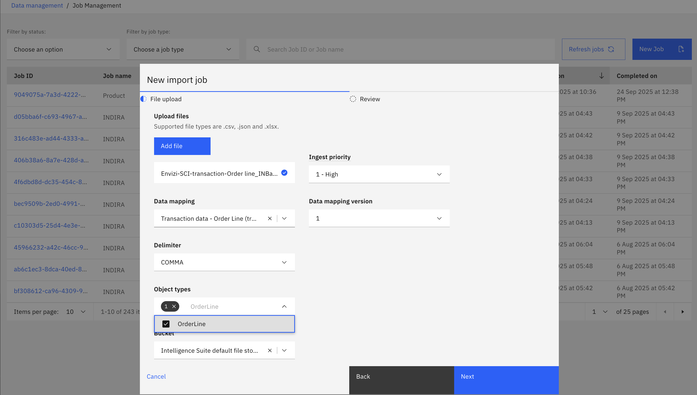
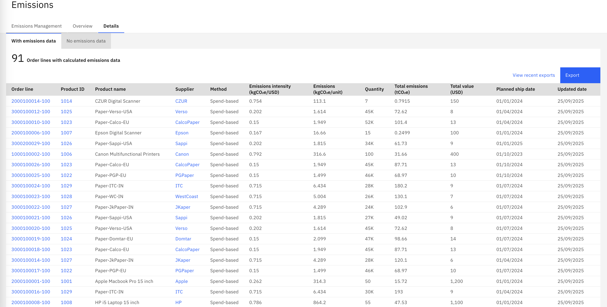

# Import transactional data

After master data and mappings are configured (and seldom change), proceed to import transactional data - primarily purchase transactions like orders and order-line items into the system.

The purchased goods and services dataset captures individual order-line purchases (products or services) used to calculate greenhouse‑gas emissions at the order-line level.  It is suggested to load historical data during setup, then append incremental transactions regularly (daily/weekly/monthly based on transaction volume. 
Organization must look at automating the continuous transactional data coming from systems such as ERP/SAP or middleware (API, SFTP, ETL) to reduce manual errors and latency. If automation isn’t possible immediately, schedule regular CSV exports and imports. Use the provided CSV template as the authoritative layout and work with your integration team to move from manual uploads to an automated ingestion pipeline.

In this Turtoral we will learn the CSV template related to transactional data and load the same through job manager using UI via manual approach

## 1. Get the Transaction Order Template

1. Copy the template file with the name *Envizi-SCI-transaction-Order line.csv* 

  

2. Review the header columns and sample data. Detailed explanations for each column are provided [here](https://www.ibm.com/docs/en/envizi-supply-chain?topic=configuring-adding-purchased-goods-services-data):

Below are the key fields for each purchasing location, presented with a short description and examples where helpful.

- **Order ID** (Required)
    - Unique identifier for an order. This can be transaction id coming from other systems, as long as it is unique id. 
    - Example: `1000100211`

- **Order line number** (Required)
    - Sequential number of the order line within the order. The Order can have multiple order lines, for example think of an amazon order of 4 items purchased together might be delivered as different shipments/packages, hence each is treated as seperate orderline.  
    - Example: `100`

- **Product ID** (Required)
    - Unique identifier for the product in the order line. Must match with the Product ID of the master product list. 
    - Example: `1001`

- **Supplier ID** (Required)
    - Unique identifier for the organization supplying the order. Must match match with the Supplier ID of the master Supplier list. 
    - Example: `Apple`

- **Purchasing organization ID** (Required (UI))
    - Identifier for the buying organization. Must match with the  `Organization ID` of  Purchasing Org data file from master data.  
    - Example: `INBank`

- **Purchasing location ID** (Required)
    - Identifier for the Purchasing location. Must match with value of  `Location ID` of  Purchasing Location data file from master data. As there may be multiple locations the organization is purchasing the products / goods , it is important to identify the same correctly and setup accordingly in the system. For example, in our sample organization (INBank), there are 3 different locations INBank-APAC-Ops, INBank-US-Ops,INBank-EMEA-Ops
    - Example: `INBank-US-Ops`

- **Quantity** (Required)
    - Quantity of products or materials in the order line. This field represents basically the number of units purchased associated with quantity measured in the next field `Quantity units`
    - Example: `300`

- **Quantity units** (Required)
    - Units of measure from the source system (standard UOM or ISO format). In general, the procurement uses `EA` represent `Each`. However it can be also be any of the ISO formats 
    - Example: `EA`

- **Value** (Required)
    - Total monetary value of products or materials in the order line in the USD currency.  Please note that currently only `USD` is supported. However product team is working on supporting other local currencies, so once delivered this field `value` represents the currency in terms of the field `Currency`
    - Example: `1200`

- **Currency** (Required)
    - Currency designation in ISO 4217 format. Note: only `USD` is supported.
    - Example: `USD`

- **Shipment date** (Required)
    - The date the order was shipped. Required format: `YYYY-MM-DD`.
    - Example: `2023-10-01`

- **Status** (Optional)
    - Status of the order line.
    - Example: `Delivered`

## 2. Populate the Purchasing location file

For INBank organization, below is a sample order and order line transactions. 

Sample data  shown below 

  

You can use the pre-populated data file provided here and update it as needed: `data-files/3. Transaction data/Envizi-SCI-transaction-Order line_INBank.csv`

## 3 Upload the Transactional data to SCI

1. **Navigate to Data Management**
  - On the left sidebar, go to `Admin > Data Management`.

2. **Start a New Import Job**
  - On the Data Management page, click `Upload data > Upload Data`.
  - In the New Import Job pop-up, click `Add file` and select your completed transactions data file (e.g., `Envizi-SCI-transaction-Order line_INBank.csv`).
  - You can leave `Ingest priority` as default.

3. **Select Data Mapping**
  - From the list of Data Mappings, select `Transaction data - Order Line (transactionDataOrderLine)`.
  - Leave `Data mapping version` and `Delimiter` as default (`COMMA`).

  

4. **Set Other Import job Options**

  - `Object types` will be auto-populated based on your mapping. (The Transaction data - Order Line template creates an object: `OrderLine`)
  - Leave `Bucket` as default: `Intelligence Suite default file storage`.
  
5. **Review and Import**
  - Click `Next` to review your selections.
  - Click `Import` to start the job.
  - You should see a message: _New import job created. Job {Job ID} has been successfully created._
 

6. **Check Import Status**
  - Uploading the transactions/ orderline  data will create a object type `OrderLine`
 

 - Ensure  the import job has completed successfully before proceeding. If a job is `CompletedWithErrors` or `Rejected`:
    - Open the job details page and review the error messages.
    - See the Troubleshooting guide: [Troubleshooting](troubleshooting.md).
    - Identify the root cause, correct the CSV, and re-run the import.
    - Repeat until the job show `Completed`.

7. **View Orderlines data in SCI**
   
    Once the orderlines are ingested successfully, the platform automatically calculates the emissions applying the default GHG method `Spend-based`.  The details page, provides insights on such as  GHG `Method` applied,` Emissions intensity (kgCO₂e/USD)`, `Emissions (kgCO₂e/unit)`, `Total Emission (tCo2e)` along with the other details of the orderline.

    To view details of Orderlines. 

  - Navigate to  `Monitoring > Emissions > Details` to view the products.

  

    To view overall emissions and various other insights related to supplier/ category/location/source country, etc : 

- Navigate to  `Monitoring > Emissions > Overview` to view the products.

Make sure to use the date filters to show the appropriate data betwen Start date and End date.

